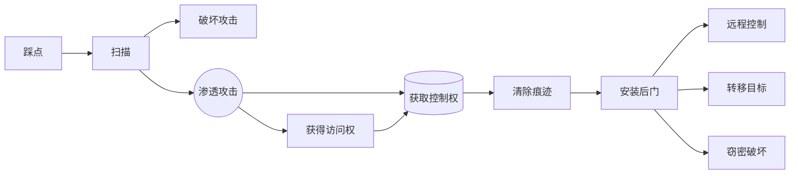

#### 通用测试渗透框架

1. 范围界定

   开始技术性安全评估之前，务必要观察、研究目标环境的被测范围，同时要了解牵扯多少单位，有多少个单位会参与到评估工作中，需要考虑的电信因素如下：

   1. 测试对象是什么
   2. 应当采用何种测试方法
   3. 有哪些在测试过程中需要满足的条件
   4. 哪些因素可能会限制测试执行的过程
   5. 需要多久才能完成测试
   6. 此次测试应当达成什么样的任务目标

2. 信息搜集

   使用公开资源获取目标相关信息：论坛、公告板、新闻组、媒体文章、博客、社交网路、其他商业或非商业性的网站

   通过搜索引擎收集：DNS、服务器和路由关系、whois数据库、电邮地址、电话号码、个人信息、用户账户等，收集越详细，渗透成功率越高

3. 目标识别

   此阶段主要任务是识别目标的网络状态、操作系统和网络架构。该阶段工作旨在完整的展现目标网络里各种联网设备或技术的完整关系，帮助测试人员在接下来的工作里枚举目标网络的各种服务

   知道被测对象网络内都有哪些联网设备，这些联网设备怎样通信

4. 服务枚举

   端口扫描，通过前面阶段的成果，找出目标系统中所有开放的端口。一旦找到了所有的开放端口，就可以通过这些端口列出目标系统上运行的服务。主机上开放的端口都有对应的服务程序，对这些信息进行深度分析后，可以进一步发掘目标网络基础设施中可能存在的漏洞

5. 漏洞映射

   漏洞扫描，根据已经发现的开放端口和服务程序，查找、分析目标系统中存在的漏洞。采用自动和手动两种不同的测试方法，审计人员对目标系统的认知就会更加清晰、透彻，并能够仔细的检查任何已知和未知的漏洞

6. 社会工程学

   如果网络没有直接的入口，欺骗的艺术将起到抛砖引玉的重要作用。对目标组织中的人员进行定向攻击，很有可能帮助我们找到渗透目标系统的入口。

   诱使用户安装有后门的恶意程序、伪装网络管理员要求用户提供自己的账户信息、钓鱼邮件劫持用户等等，研究人性，利用人性的弱点进行渗透

7. 漏洞利用

   检查和发现系统中的漏洞后，就可以使用已有的漏洞利用程序对目标系统进行渗透。审计人员可以把客户端漏洞利用程序和社会工程学进行结合，进而控制目标系统

8. 权限提升

   获取目标系统的控制权是渗透成功的标识，最终目的是获取目标系统的最高访问权限

9. 访问维护

   埋藏后门，在退出时清理掉。审计人员需要在一段时间内维护他们对目标系统的访问权限，在演示越权访问目标系统的时候，安装后门将节省重新渗透目标系统所耗费的大量时间。

10. 文档报告

    渗透测试的最后一个环节，记录、报告现场演示那些已经识别、验证和利用了的安全漏洞。

    在被测单位的管理和技术团队会检查渗透时使用的方法，并会根据这些文档修补所有存在的安全漏洞

    文档报告的工作十分重要，为了帮助管理人员和技术人员共同理解、分析当前IT基础架构中的薄弱环节，可能需要给不同的部门撰写不同措辞的书面报告

    这些报告还可以用来获取和对比渗透测试前后目标系统的完整性

#### 实际工作中简化的测试流程

1. 明确目标

   确定范围、明确规则、确定需求

2. 信息收集

   基础信息、系统信息、应用信息、人员信息、防护信息

3. 漏洞探测

   系统漏洞、web服务漏洞、web应用漏洞、其他端口、通信安全

4. 漏洞验证

   手工验证、工具验证、实验验证

5. 漏洞利用

   定制EXP、防御绕过、进一步渗透、清理痕迹

6. 形成报告

   整理结果、补充介绍、修复建议

#### 黑客攻击的一般过程

